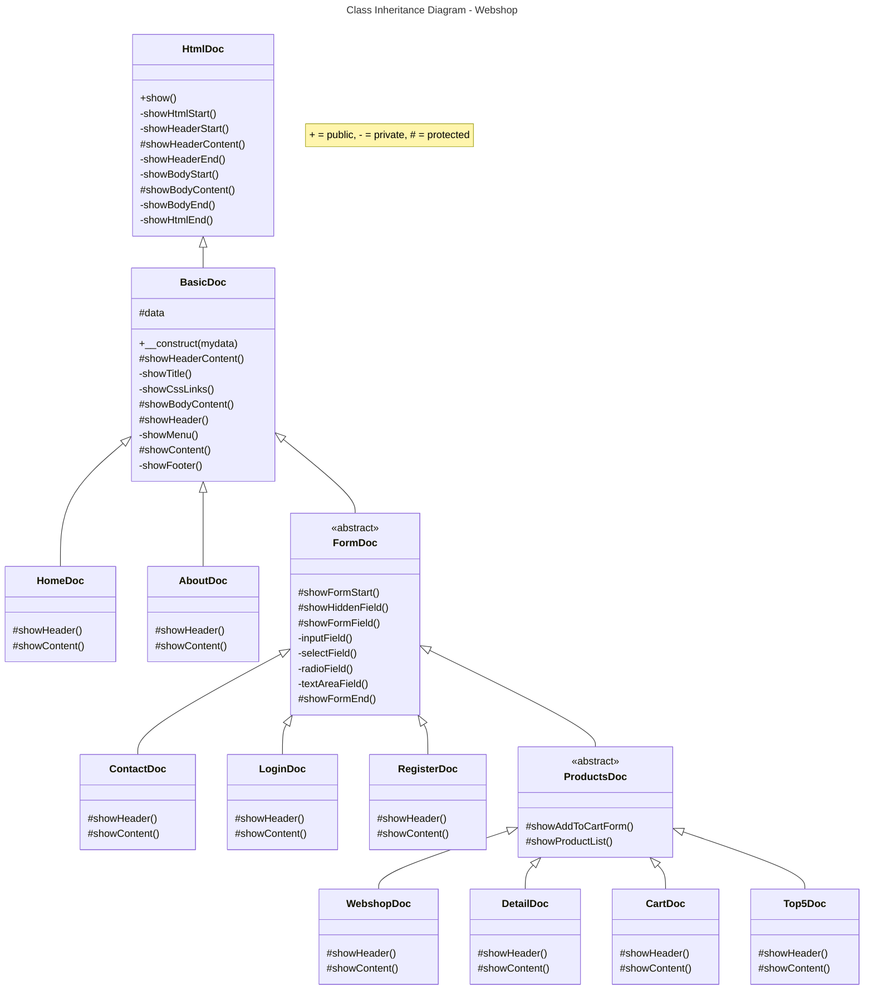

```mermaid
---
title: Class Inheritance Diagram - Webshop
---
classDiagram
    note "+ = public, - = private, # = protected"
    %% A <|-- B means that class B inherits from class A %%
    HtmlDoc <|-- BasicDoc

    BasicDoc <|-- HomeDoc
    BasicDoc <|-- AboutDoc
    BasicDoc <|-- FormDoc

    FormDoc <|-- ContactDoc
    FormDoc <|-- LoginDoc
    FormDoc <|-- RegisterDoc
    FormDoc <|-- ProductsDoc

    ProductsDoc <|-- WebshopDoc
    ProductsDoc <|-- DetailDoc
    ProductsDoc <|-- CartDoc
    ProductsDoc <|-- Top5Doc

    class HtmlDoc{
       +show()
       -showHtmlStart()
       -showHeaderStart()
       #showHeaderContent()
       -showHeaderEnd()
       -showBodyStart()
       #showBodyContent()
       -showBodyEnd()
       -showHtmlEnd()
    }
    class BasicDoc{
        #data 
        +__construct(mydata)
        #showHeaderContent()
        -showTitle()
        -showCssLinks()
        #showBodyContent()
        #showHeader()
        -showMenu()
        #showContent()
        -showFooter()
    }
    class HomeDoc{
        #showHeader()
        #showContent()
    }
    class AboutDoc{
        #showHeader()
        #showContent()
    }
    class FormDoc{
        <<abstract>>
        #showFormStart()
        #showHiddenField()
        #showFormField()
        -inputField()
        -selectField()
        -radioField()
        -textAreaField()
        #showFormEnd()
    }
    class ContactDoc{
        #showHeader()
        #showContent()
    }
    class LoginDoc{
        #showHeader()
        #showContent()
    }
    class RegisterDoc{
        #showHeader()
        #showContent()
    }

    class ProductsDoc{
        <<abstract>>
        #showAddToCartForm()
        #showProductList()
    }
    class WebshopDoc{
        #showHeader()
        #showContent()
    }
    class DetailDoc{
        #showHeader()
        #showContent()
    }
    class CartDoc{
        #showHeader()
        #showContent()
    }
    class Top5Doc{
        #showHeader()
        #showContent()
    }

```
