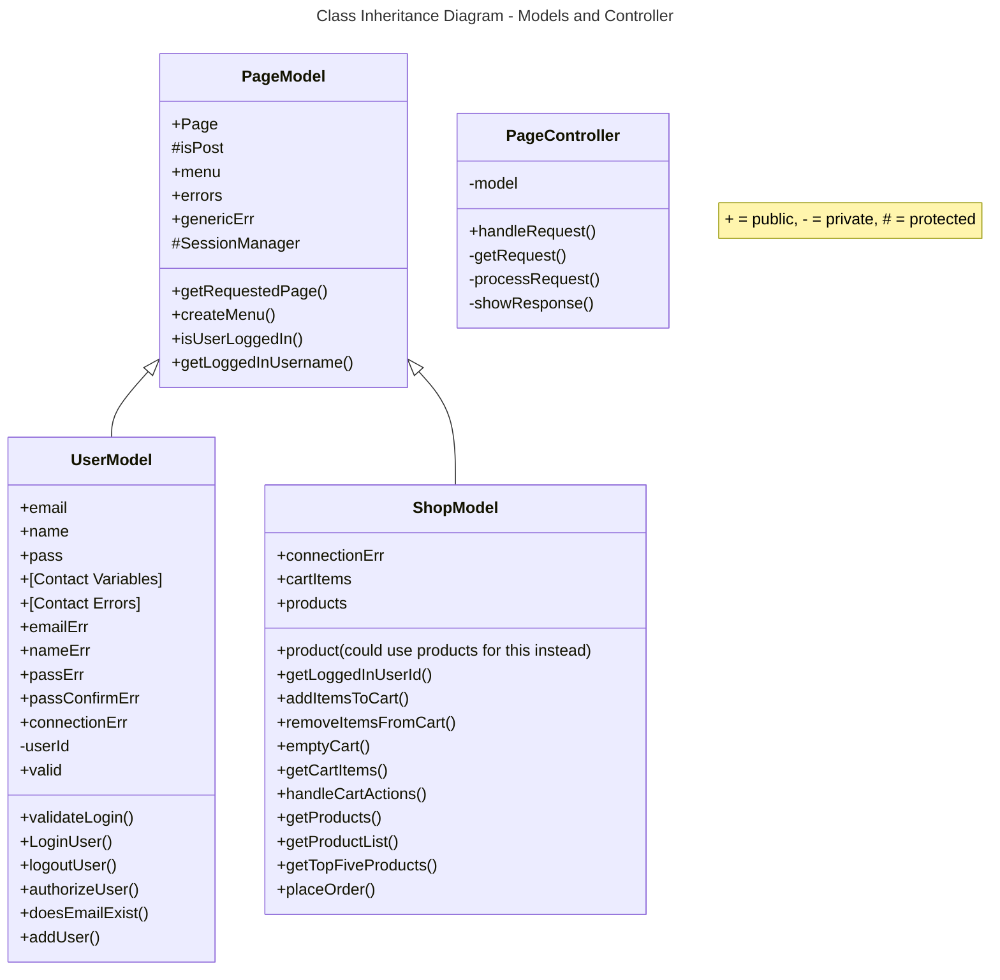

```mermaid
---
title: Class Inheritance Diagram - Models and Controller
---
classDiagram
    note "+ = public, - = private, # = protected"
    %% A <|-- B means that class B inherits from class A %%
    PageModel <|-- UserModel
    PageModel <|-- ShopModel

    class PageModel{
        +Page
        #isPost
        +menu
        +errors
        +genericErr
        #SessionManager

        +getRequestedPage()
        +createMenu()
        +isUserLoggedIn()
        +getLoggedInUsername()
    }
    class UserModel{
        +email
        +name
        +pass
        +[Contact Variables]
        +[Contact Errors]
        +emailErr
        +nameErr
        +passErr
        +passConfirmErr
        +connectionErr

        -userId
        +valid

        +validateLogin()
        +LoginUser()
        +logoutUser()
        +authorizeUser()
        +doesEmailExist()
        +addUser()
    }
    class ShopModel{
        +connectionErr
        +cartItems
        +products
        +product (could use products for this instead)

        +getLoggedInUserId()
        +addItemsToCart()
        +removeItemsFromCart()
        +emptyCart()
        +getCartItems()

        +handleCartActions()
        +getProducts()
        +getProductList()
        +getTopFiveProducts()
        +placeOrder()
    }

    class PageController {
        -model

        +handleRequest()
        -getRequest()
        -processRequest()
        -showResponse()
    }
    

```
